# 모든 타입  고려 구글시트 데이터 파싱

## 만들어진 이유
- 이런 스프레드 시트 파싱 만들 때 마다 좀 하드코딩 하는거 같아서.
- 범용성 있게 만들면 좋을거 같아서 제작.
- 구글 시트 전용임.

---
### 갱신일  : 2026-05-22
## 사용방법(구글 시트전용)

 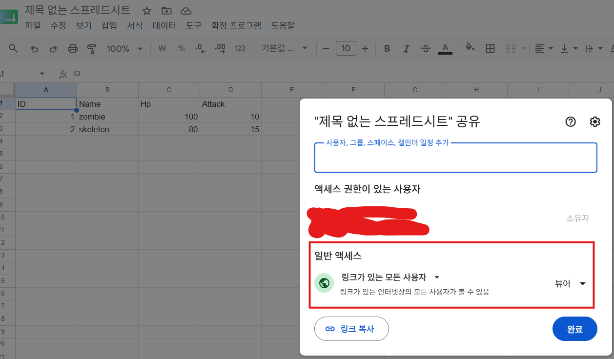
 
- 파싱할 구글시트의 액세스 설정을 링크가 있는 모든 사용자로 변경  

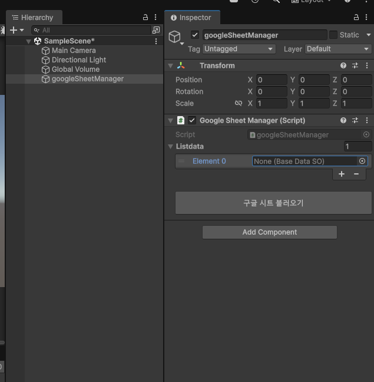  

- 구글 시트 매니저 스크립트를 하이라이키 창에 만든다.  

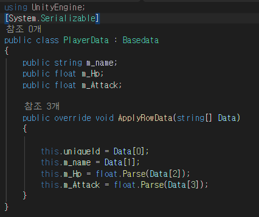  

- 직렬화가 되도록 ``[System.Serializable]`` 작성

-  public override void ApplyRowData(string[] Data) 완성하기
    - 시트에 열 단위로 어떤 데이터 인지 모르기 때문에 구글 시트 보고 맞는 데이터 타입에 값 설정해주기
-  this.uniqueId <-- 데이터 식별용 string 이다 구글시트에서 ID속한 값을 넣어주면된다.
   
   ---
  

- So 데이터를 만들어야하는데 구분용 클래스명 만들고  
`` : SheetDataSO<PlayerData> 상속시킨다.``

- ``[CreateAssetMenu(menuName = "PlayerSO", fileName = "test")]  ``  
SO를 만들기위해서 CreateAssetMenu 속성을 사용한다.  
  
   ---
   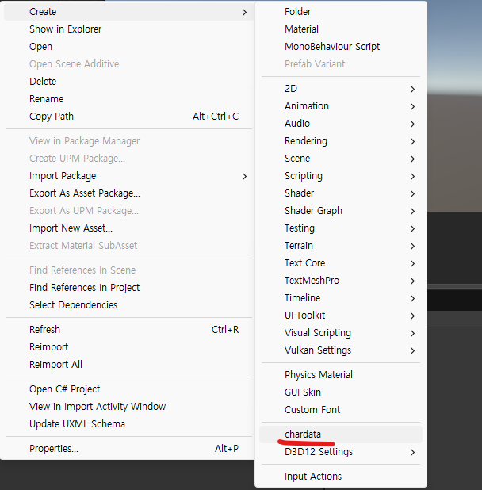

- SO를 생성시키면 다음과 같다.  

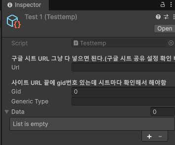  

- 여기서  구글 시트 URL를 통으로 긁어다가 붙여주고
- url 뒤에 gid 번호를 따로 입력해준다.
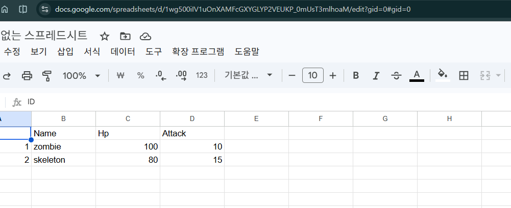
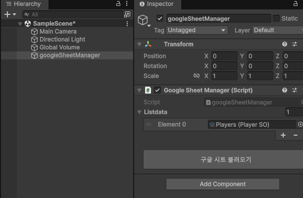  

- 만든 SO를 구글시트매니저에 넣어준다.  
- 그리고 구글시트 불러오기 버튼을 눌러주면 된다.  

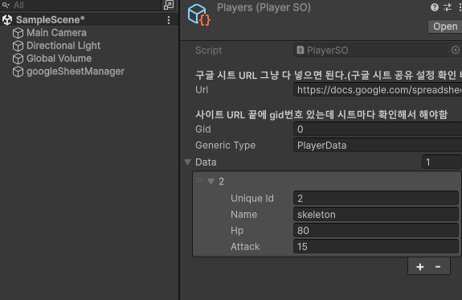

- 지금은 3행부터 가져오게 되어있는데

SheetLoader클래스에서 ParseCSV함수가 있는데.  

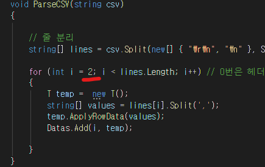  

for문에 int i=2를 수정해주면 된다.  

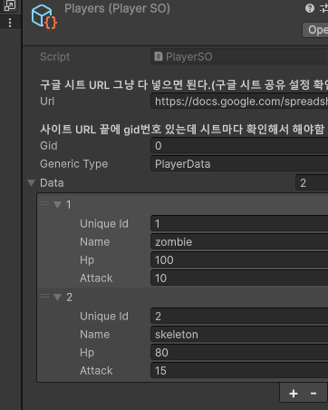  

- 1로 수정했더니 2행부터 잘 가져와진다.  
----

# 데이터 가져오기

- 구글시트 매니저에 접근해 ``GetClassData<T>();`` 사용한다.  
- 가져 올 데이터 타입을``<T>``안에 넣는다.
- 그러면   저장된SO를  반환해주는데 값을 찾을 때는 Id(uniqueId) 번호를 넣어서 값을 찾아주면된다.  

-----

2026-06-22 추가한 부분
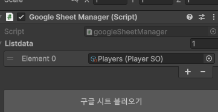  
구글 시트 불러오기 버튼 누르면 
기존 List에 있는 데이터를 한번 비우고
Resources/지정폴더 에서 데이터를 가져온 후 List에 저장 시킨다. 그 이후에 파싱을 시작하는 기능 추가

한줄 : 버튼 누르면 폴더에서 SO 긁어와서 저장 후 파싱함.
